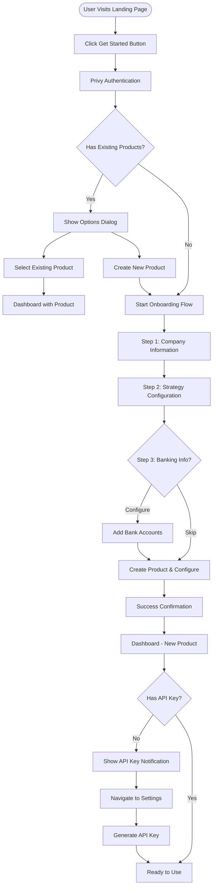

# Client Onboarding Flow - Visual Guide

## 🎯 Complete User Journey Map



## 📱 Screen-by-Screen Wireframes

### 1️⃣ Landing Page
```
┌──────────────────────────────────────────────────────────┐
│  PROXIFY                                    [Get Started] │
├──────────────────────────────────────────────────────────┤
│                                                           │
│        Transform Idle Cash into Yield                    │
│                                                           │
│        White-label DeFi infrastructure for               │
│        platforms with user balances                      │
│                                                           │
│                   [Get Started →]                        │
│                                                           │
│  ┌─────────┐  ┌─────────┐  ┌─────────┐                 │
│  │   5-8%  │  │ Custodial│  │  Multi- │                 │
│  │   APY   │  │  Pooling │  │  Chain  │                 │
│  └─────────┘  └─────────┘  └─────────┘                 │
│                                                           │
└──────────────────────────────────────────────────────────┘
```

### 2️⃣ Company Information Form (Step 1/3)
```
┌──────────────────────────────────────────────────────────┐
│  Create Your Product         Step 1 of 3    [●]○○        │
├──────────────────────────────────────────────────────────┤
│                                                           │
│  Company Information                                     │
│  ─────────────────────────────────────────────          │
│                                                           │
│  Company Name *                                          │
│  [_____________________________________]                 │
│                                                           │
│  Business Type *                                         │
│  [E-commerce           ▼]                                │
│                                                           │
│  Industry Vertical *                                     │
│  [Select Industry      ▼]                                │
│                                                           │
│  Website URL                                             │
│  [_____________________________________]                 │
│                                                           │
│  Description                                             │
│  [_____________________________________]                 │
│  [_____________________________________]                 │
│                                                           │
│  Customer Base Size * (affects AI recommendations)       │
│  ○ 0-1,000 customers                                     │
│  ● 1,000-10,000 customers                                │
│  ○ 10,000-100,000 customers                              │
│  ○ 100,000-1,000,000 customers                           │
│  ○ 1,000,000+ customers                                  │
│                                                           │
│  Estimated Assets Under Management (AUM) *               │
│  $ [_____________________________________]               │
│                                                           │
│  Primary Use Case *                                      │
│  [Idle cash yield      ▼]                                │
│                                                           │
│                              [Back]  [Next →]            │
└──────────────────────────────────────────────────────────┘
```

### 3️⃣ Strategy Configuration (Step 2/3)
```
┌──────────────────────────────────────────────────────────┐
│  Configure Strategies        Step 2 of 3    ○[●]○        │
├──────────────────────────────────────────────────────────┤
│                                                           │
│  Rank Your Investment Priorities                         │
│  Drag cards to reorder (1 = highest priority)            │
│  ─────────────────────────────────────────────          │
│                                                           │
│  ┌─────────────────────────────────────────┐ ≡          │
│  │ 1. DeFi Lending                         │            │
│  │ Low risk, steady yields (5-8% APY)      │            │
│  │ AAVE, Compound, Morpho                  │            │
│  └─────────────────────────────────────────┘            │
│                                                           │
│  ┌─────────────────────────────────────────┐ ≡          │
│  │ 2. Liquidity Pools                      │            │
│  │ Medium risk, higher yields (8-15%)      │            │
│  │ Uniswap, Curve, Balancer                │            │
│  └─────────────────────────────────────────┘            │
│                                                           │
│  ┌─────────────────────────────────────────┐ ≡          │
│  │ 3. CeFi Platforms                       │            │
│  │ Low risk, regulated (4-6% APY)          │            │
│  │ Licensed partners                        │            │
│  └─────────────────────────────────────────┘            │
│                                                           │
│  ┌─────────────────────────────────────────┐ ≡          │
│  │ 4. Hedging Strategies                   │            │
│  │ Risk mitigation (3-5% APY)              │            │
│  │ Delta-neutral positions                  │            │
│  └─────────────────────────────────────────┘            │
│                                                           │
│  ┌─────────────────────────────────────────┐ ≡          │
│  │ 5. Arbitrage                            │            │
│  │ Advanced strategies (Variable)           │            │
│  │ Cross-protocol opportunities             │            │
│  └─────────────────────────────────────────┘            │
│                                                           │
│  Risk Tolerance                                          │
│  ○ Conservative  ● Moderate  ○ Aggressive               │
│                                                           │
│                     [← Back]  [Next →]                   │
└──────────────────────────────────────────────────────────┘
```

### 4️⃣ Banking Configuration (Step 3/3 - Optional)
```
┌──────────────────────────────────────────────────────────┐
│  Banking Information         Step 3 of 3    ○○[●]        │
├──────────────────────────────────────────────────────────┤
│                                                           │
│  Configure Bank Accounts (Optional)                      │
│  You can set this up later in Settings                   │
│  ─────────────────────────────────────────────          │
│                                                           │
│  ┌─────────────────────────────────────────┐            │
│  │ ℹ️ Bank accounts are used for fiat       │            │
│  │ off-ramp (withdrawals to traditional     │            │
│  │ banking). This can be configured later.  │            │
│  └─────────────────────────────────────────┘            │
│                                                           │
│  Bank Account 1                                          │
│  ┌──────────────────────────────────────┐               │
│  │ Currency: [USD ▼]  Bank: [________]  │               │
│  │ Account #: [_____] Name: [________]  │               │
│  │ SWIFT: [_________] [Remove]          │               │
│  └──────────────────────────────────────┘               │
│                                                           │
│  [+ Add Another Account]                                 │
│                                                           │
│                                                           │
│                                                           │
│                                                           │
│             [← Back]  [Skip]  [Complete →]               │
└──────────────────────────────────────────────────────────┘
```

### 5️⃣ Success & Dashboard Redirect
```
┌──────────────────────────────────────────────────────────┐
│  Success! 🎉                                             │
├──────────────────────────────────────────────────────────┤
│                                                           │
│             ✓ Product Created Successfully               │
│                                                           │
│  Product ID: prod_xxxxxxxxxxx                            │
│                                                           │
│  Your product has been created and configured.           │
│  You're being redirected to your dashboard...            │
│                                                           │
│                    [Go to Dashboard →]                   │
│                                                           │
└──────────────────────────────────────────────────────────┘
```

### 6️⃣ Dashboard with API Key Notification
```
┌──────────────────────────────────────────────────────────┐
│  Dashboard                           [Settings] [Logout]  │
├──────────────────────────────────────────────────────────┤
│                                                           │
│  ┌─────────────────────────────────────────────────┐    │
│  │ ℹ️ Setup Required                               │    │
│  │ Generate your API key to start integrating      │    │
│  │                         [Go to Settings →]      │    │
│  └─────────────────────────────────────────────────┘    │
│                                                           │
│  Welcome to Proxify!                                     │
│                                                           │
│  Total AUM: $0.00                                        │
│  Active Users: 0                                         │
│  Current APY: --                                         │
│                                                           │
└──────────────────────────────────────────────────────────┘
```

## 🔄 State Flow Diagram

```
┌─────────────────────────────────────────────────────────┐
│                   Onboarding Store                       │
├─────────────────────────────────────────────────────────┤
│                                                           │
│  State Tree:                                             │
│  ├── currentStep: 0 | 1 | 2 | 3                         │
│  ├── completedSteps: number[]                            │
│  │                                                       │
│  ├── companyInfo                                         │
│  │   ├── companyName: string                            │
│  │   ├── businessType: string                           │
│  │   ├── customerTier: enum                             │
│  │   ├── estimatedAUM: string                           │
│  │   └── ...                                            │
│  │                                                       │
│  ├── strategies                                          │
│  │   ├── priorities: StrategyPriority[]                 │
│  │   └── riskTolerance: enum                            │
│  │                                                       │
│  └── bankingInfo                                         │
│      ├── configured: boolean                             │
│      └── accounts: BankAccount[]                         │
│                                                           │
│  Actions:                                                │
│  • setCompanyInfo(data)                                  │
│  • setStrategies(data)                                   │
│  • setBankingInfo(data)                                  │
│  • nextStep()                                            │
│  • previousStep()                                        │
│  • resetOnboarding()                                     │
│                                                           │
└─────────────────────────────────────────────────────────┘
```

## 📊 Component Hierarchy

```
<OnboardingLayout>
  <StepIndicator currentStep={0} totalSteps={3} />

  <Routes>
    <Route path="company-info">
      <CompanyInfoForm
        onSubmit={handleCompanyInfo}
        initialData={companyInfo}
      />
    </Route>

    <Route path="strategies">
      <StrategySelector
        onSubmit={handleStrategies}
        initialPriorities={strategies.priorities}
      />
    </Route>

    <Route path="banking">
      <BankAccountForm
        onSubmit={handleBanking}
        onSkip={handleSkip}
        initialAccounts={bankingInfo.accounts}
      />
    </Route>
  </Routes>

  <FormNavigation
    onNext={nextStep}
    onBack={previousStep}
    canProgress={isValid}
    isLastStep={currentStep === 2}
  />
</OnboardingLayout>
```

## 🎯 Key Decision Points

### 1. New vs Returning User
```typescript
if (user.authenticated) {
  if (user.products.length > 0) {
    // RETURNING USER PATH
    showProductSelector() || navigateToDashboard()
  } else {
    // NEW USER PATH
    startOnboarding()
  }
}
```

### 2. Customer Tier Impact
```typescript
const getTierRecommendations = (tier: CustomerTier) => {
  switch(tier) {
    case '0-1000':
      return {
        suggestedStrategies: ['DeFi', 'CeFi'],
        riskProfile: 'conservative',
        supportLevel: 'standard'
      }
    case '1000000+':
      return {
        suggestedStrategies: ['DeFi', 'LP', 'Arbitrage'],
        riskProfile: 'moderate-aggressive',
        supportLevel: 'enterprise'
      }
  }
}
```

### 3. Strategy Ranking Logic
```typescript
const strategyPriorities = [
  { id: 1, type: 'defi', rank: 1 },     // Highest priority
  { id: 2, type: 'lp', rank: 2 },
  { id: 3, type: 'cefi', rank: 3 },
  { id: 4, type: 'hedge', rank: 4 },
  { id: 5, type: 'arbitrage', rank: 5 }  // Lowest priority
]
```

## 🔗 API Call Sequence

```typescript
// Step 1: Register Client
const client = await api.registerClient({
  ...companyInfo,
  privyWalletAddress: user.wallet
})

// Step 2: Configure Strategies
await api.configureStrategies(client.productId, {
  strategies: mapPrioritiesToStrategies(strategies.priorities)
})

// Step 3: Configure Banking (if provided)
if (bankingInfo.configured) {
  await api.configureBankAccounts(client.productId, {
    bankAccounts: bankingInfo.accounts
  })
}

// Step 4: Navigate to Dashboard
navigate('/dashboard', {
  state: { newProduct: true, productId: client.productId }
})
```

---

**Visual Guide Version:** 1.0.0
**Created:** 2024-12-03
**Purpose:** Visual reference for implementing client onboarding flow