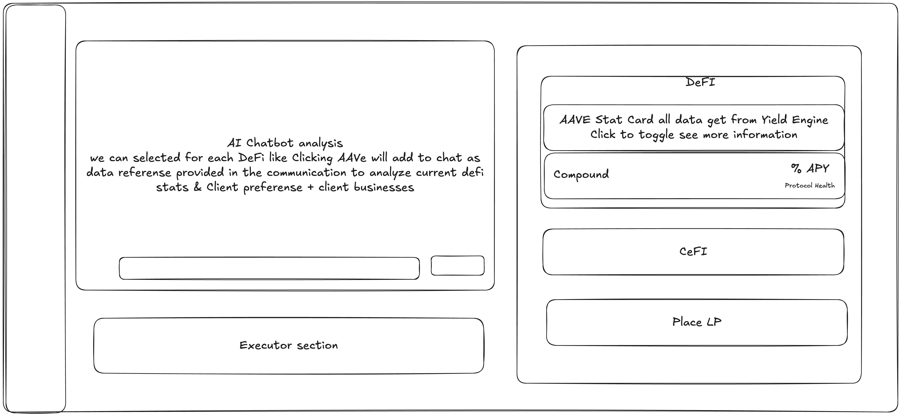

# Market Dashboard - Core Specification & Implementation Guide

> **Status**: Source of Truth for Market Analysis Dashboard
> **Last Updated**: 2025-12-01
> **Version**: 1.0 - Initial Design

---

## 🎯 **Vision & Purpose**

### **What We're Building**
An AI-powered DeFi analytics dashboard where Product Owners can:
1. **Analyze DeFi Protocols** - View real-time yield data from AAVE, Compound, Morpho, Curve
2. **Get AI Recommendations** - ChatGPT/Claude analyzes data and suggests optimal strategies
3. **Execute Strategies** - Deploy funds to selected protocols with one click
4. **Track Portfolio** - Monitor real Mock USDC balance and yield performance

### **User Flow**
```
Product Owner logs in
    ↓
Opens Market Dashboard
    ↓
Views real-time protocol data (APY, TVL, Risk)
    ↓
Asks AI: "Which protocol should I use for $500K?"
    ↓
AI analyzes data → Recommends Morpho (6.5% APY, Low Risk)
    ↓
Owner selects protocols in Executor
    ↓
Clicks "Deploy Strategy"
    ↓
Funds allocated to chosen protocols
```

---

## 📐 **UI/UX Design Specification**

### **Layout Architecture**

```
┌────────────────────────────────────────────────────────────────┐
│ HEADER: Market Intelligence Dashboard                          │
│ Balance: $X,XXX Mock USDC  |  Last Update: 2 mins ago         │
└────────────────────────────────────────────────────────────────┘

┌──────────────────────────┬─────────────────────────────────────┐
│  LEFT COLUMN (40%)       │  RIGHT COLUMN (60%)                 │
│                          │                                     │
│  ┌────────────────────┐  │  ┌───────────────────────────────┐ │
│  │ AI Chatbot         │  │  │ DeFi Category ▼               │ │
│  │ ────────────────── │  │  ├───────────────────────────────┤ │
│  │                    │  │  │ ┌─────────┐ ┌─────────┐       │ │
│  │ User: Which best?  │  │  │ │  AAVE   │ │ Compound│       │ │
│  │                    │  │  │ │ 5.2% APY│ │ 4.8% APY│       │ │
│  │ AI: Morpho offers  │  │  │ │ Toggle  │ │ Toggle  │       │ │
│  │ 6.5% APY with low  │  │  │ └─────────┘ └─────────┘       │ │
│  │ risk...            │  │  └───────────────────────────────┘ │
│  │                    │  │                                     │
│  │ [Input box]  [Send]│  │  ┌───────────────────────────────┐ │
│  └────────────────────┘  │  │ CeFi Category ▶                │ │
│                          │  └───────────────────────────────┘ │
│  ┌────────────────────┐  │                                     │
│  │ Executor Section   │  │  ┌───────────────────────────────┐ │
│  │ ────────────────── │  │  │ Place LP Category ▶            │ │
│  │ ☑ AAVE (5.2%)      │  │  └───────────────────────────────┘ │
│  │ ☑ Morpho (6.5%)    │  │                                     │
│  │ ☐ Compound (4.8%)  │  │  ┌───────────────────────────────┐ │
│  │                    │  │  │ Arbitrage Category ▶           │ │
│  │ [Deploy Strategy]  │  │  └───────────────────────────────┘ │
│  └────────────────────┘  │                                     │
│                          │  ┌───────────────────────────────┐ │
│                          │  │ Hedging Category ▶             │ │
│                          │  └───────────────────────────────┘ │
└──────────────────────────┴─────────────────────────────────────┘
```

### **Design Reference: Sketch Wireframe**


<!-- TODO: Add image file reference here -->

**Key UI Elements from Sketch:**
1. **Left Side**: AI chat interface + Executor buttons below
2. **Right Side**: Collapsible category sections (DeFi, CeFi, LP, Arbitrage, Hedging)
3. **Protocol Cards**: Toggle between "Overview" (APY/TVL) and "Raw Data" (all metrics)
4. **Gray Theme**: Avici Finance inspired dark gray palette

### **Color Palette (Gray Theme)**

```css
/* Background Colors */
--bg-main: #1a1b1e           /* Main page background */
--bg-card: #25262b           /* Card/section background */
--bg-hover: #2c2d33          /* Hover states */
--bg-input: #1a1b1e          /* Input fields */

/* Text Colors */
--text-primary: #ffffff      /* Headings, important text */
--text-secondary: #909296    /* Body text, descriptions */
--text-tertiary: #5c5f66     /* Subtle text, labels */

/* Border Colors */
--border-default: #373a40    /* Default borders */
--border-hover: #4a4d54      /* Hover borders */
--border-focus: #4dabf7      /* Focus/active borders */

/* Accent Colors */
--accent-green: #51cf66      /* Positive APY, Success */
--accent-red: #ff6b6b        /* Negative, Errors */
--accent-blue: #4dabf7       /* Primary actions, Links */
--accent-yellow: #ffd43b     /* Warnings */
--accent-purple: #9775fa     /* Protocol highlights */

/* Status Colors */
--status-healthy: #51cf66    /* Protocol healthy */
--status-warning: #ffd43b    /* Protocol warning */
--status-critical: #ff6b6b   /* Protocol critical */
```

---

## 🏗️ **Technical Architecture**

### **Component Hierarchy**

```
apps/whitelabel-web/src/feature/dashboard/
├── MarketPage.tsx                          # Main container (2-column grid)
│
├── components/
│   ├── ai/
│   │   ├── AIChatInterface.tsx             # LEFT: Chat UI
│   │   ├── ChatMessage.tsx                 # Individual message bubble
│   │   └── ChatInput.tsx                   # Input box + Send button
│   │
│   ├── executor/
│   │   ├── ExecutorSection.tsx             # LEFT: Protocol selection
│   │   └── DeploymentModal.tsx             # Confirmation modal
│   │
│   ├── categories/
│   │   ├── CategorySection.tsx             # RIGHT: Collapsible section
│   │   ├── DeFiCategory.tsx                # DeFi-specific category
│   │   ├── CeFiCategory.tsx                # CeFi category
│   │   ├── LiquidityPoolCategory.tsx       # LP category
│   │   ├── ArbitrageCategory.tsx           # Arbitrage category
│   │   └── HedgingCategory.tsx             # Hedging category
│   │
│   ├── protocol-cards/
│   │   ├── ProtocolCard.tsx                # Base card component
│   │   ├── OverviewView.tsx                # APY/TVL/Status display
│   │   ├── RawDataView.tsx                 # Full metrics JSON/table
│   │   ├── AAVECard.tsx                    # AAVE-specific styling
│   │   ├── CompoundCard.tsx                # Compound-specific styling
│   │   └── MorphoCard.tsx                  # Morpho-specific styling
│   │
│   └── shared/
│       ├── StatusBadge.tsx                 # Healthy/Warning/Critical
│       ├── APYDisplay.tsx                  # Formatted APY with color
│       └── LoadingSpinner.tsx              # Loading states
│
├── hooks/
│   ├── useDeFiProtocols.ts                 # React Query data fetching
│   │   ├── useAAVEData()                   # Separate query key
│   │   ├── useCompoundData()               # Separate query key
│   │   ├── useMorphoData()                 # Separate query key
│   │   ├── useCurveData()                  # Separate query key
│   │   └── useAllDeFiProtocols()           # Combined hook
│   │
│   ├── useAIChat.ts                        # Chat state management
│   ├── useMockUSDCBalance.ts               # Wallet balance fetching
│   └── useProtocolSelector.ts              # Executor checkboxes
│
└── store/
    ├── marketDashboardStore.ts             # Zustand store (optional)
    └── aiChatStore.ts                      # Chat history persistence
```

### **Backend Services Architecture**

```
packages/core/service/
├── defi-protocol.service.ts                # NEW - DeFi data aggregator
│   ├── fetchAAVEMetrics()                  # Uses yield-engine AaveAdapter
│   ├── fetchCompoundMetrics()              # Uses yield-engine CompoundAdapter
│   ├── fetchMorphoMetrics()                # Uses yield-engine MorphoAdapter
│   ├── fetchCurveMetrics()                 # Uses yield-engine (if added)
│   └── aggregateAllProtocols()             # Returns combined data
│
├── ai-chatbot.service.ts                   # NEW - AI integration
│   ├── analyzeProtocols()                  # OpenAI GPT-3.5-turbo
│   ├── generateRecommendation()            # Based on risk/APY/TVL
│   └── handleUserQuery()                   # Process chat messages
│
└── vault-balance.service.ts                # Existing - Mock USDC balance
    └── getClientBalance()                  # Read from blockchain or DB

apps/b2b-api/src/router/
├── defi-protocols.router.ts                # NEW - API endpoints
│   ├── GET  /api/defi/protocols            # All protocols data
│   ├── GET  /api/defi/protocols/aave      # AAVE only
│   ├── GET  /api/defi/protocols/compound  # Compound only
│   └── GET  /api/defi/protocols/morpho    # Morpho only
│
├── ai-chat.router.ts                       # NEW - AI chat API
│   └── POST /api/ai/chat                   # Send message, get response
│
└── vault.router.ts                         # Existing
    └── GET  /api/vaults/:clientId/balance  # Mock USDC balance
```

---

## 📊 **Data Flow & State Management**

### **React Query Data Fetching Strategy**

```typescript
// Each protocol has its own query key for independent caching

useAAVEData()
  ↓ queryKey: ['defi', 'aave', 'usdc']
  ↓ refetchInterval: 60000 (1 minute)
  ↓ Cache: 30 seconds stale time
  ↓ Returns: { supplyAPY, tvl, liquidity, status }

useCompoundData()
  ↓ queryKey: ['defi', 'compound', 'usdc']
  ↓ Independent from AAVE
  ↓ If Compound API fails, AAVE still works

useMorphoData()
  ↓ queryKey: ['defi', 'morpho', 'usdc']
  ↓ Independent caching

useAllDeFiProtocols()
  ↓ Combines all three hooks
  ↓ Returns: { protocols: ProtocolData[], isLoading, error }
  ↓ Smart error handling: Show available data even if one fails
```

**Key Decision**: Separate query keys allow:
- Independent refetching (AAVE updates don't refetch Compound)
- Granular error handling (show partial data if one protocol fails)
- Better UX (user sees some data immediately)

### **Data Structure**

```typescript
// Core data type returned by all hooks
interface ProtocolData {
  // Identity
  protocol: 'aave' | 'compound' | 'morpho' | 'curve'
  token: string                    // 'USDC'
  chainId: number                  // 8453 (Base)

  // Yield Metrics (from yield-engine)
  supplyAPY: string                // "6.50" = 6.50%
  borrowAPY?: string               // Optional for lending protocols

  // Size Metrics
  tvl: string                      // "$500M"
  liquidity: string                // "$400M"
  totalSupplied: string            // "$500M"
  totalBorrowed?: string           // "$100M"

  // Risk Metrics (calculated)
  utilization: string              // "75.5" = 75.5%
  risk: 'Low' | 'Medium' | 'High'  // Derived from utilization + TVL
  status: 'healthy' | 'warning' | 'critical'

  // Metadata
  lastUpdate: Date
  protocolHealth: number           // 0-100 score

  // Raw Data (for "Raw Data" view)
  rawMetrics?: {
    liquidityRate?: string         // AAVE-specific
    borrowRate?: string
    reserveFactor?: string
    collateralFactor?: string
    liquidationThreshold?: string
    // ... all contract data
  }
}

// AI Chat Message
interface ChatMessage {
  role: 'user' | 'assistant' | 'system'
  content: string
  timestamp: Date
  protocolContext?: ProtocolData[] // Data used for this response
}

// Executor State
interface ExecutorState {
  selectedProtocols: string[]      // ['aave', 'morpho']
  allocationMode: 'equal' | 'weighted' | 'custom'
  allocations?: Record<string, number> // { aave: 60, morpho: 40 }
}
```

---

## 🔧 **Implementation Phases**

### **Phase 1: Data Layer Foundation** (Week 1)

**Goal**: Get real DeFi data flowing into the frontend

**Tasks**:
- [x] yield-engine package exists (DONE)
- [ ] Install React Query in whitelabel-web
- [ ] Create `packages/core/service/defi-protocol.service.ts`
  - [ ] Implement `fetchAAVEMetrics()` using AaveAdapter
  - [ ] Implement `fetchCompoundMetrics()` using CompoundAdapter
  - [ ] Implement `fetchMorphoMetrics()` using MorphoAdapter
  - [ ] Implement `aggregateAllProtocols()`
- [ ] Create API endpoints in `apps/b2b-api/src/router/defi-protocols.router.ts`
  - [ ] `GET /api/defi/protocols` - Returns all protocols
  - [ ] `GET /api/defi/protocols/:protocol` - Returns specific protocol
- [ ] Create frontend hooks in `hooks/useDeFiProtocols.ts`
  - [ ] `useAAVEData()` - React Query hook
  - [ ] `useCompoundData()` - React Query hook
  - [ ] `useMorphoData()` - React Query hook
  - [ ] `useAllDeFiProtocols()` - Combined hook
- [ ] Test data flow: Backend → API → React Query → Console.log

**Acceptance Criteria**:
- ✅ Can fetch AAVE data and see it in browser console
- ✅ Data updates every 60 seconds automatically
- ✅ If one protocol fails, others still work

---

### **Phase 2: UI Components** (Week 2)

**Goal**: Build the visual interface (no AI yet, use mock chat)

**Tasks**:
- [ ] Update `MarketPage.tsx` with 2-column grid layout
- [ ] Create `CategorySection.tsx`
  - [ ] Expand/collapse functionality
  - [ ] State management (Zustand or local state?)
- [ ] Create `ProtocolCard.tsx`
  - [ ] Card header with logo
  - [ ] Toggle button (Overview ↔ Raw Data)
  - [ ] State management for toggle
- [ ] Create `OverviewView.tsx`
  - [ ] Display: APY, TVL, Liquidity, Status badge
  - [ ] Color coding: Green APY, Status badges
- [ ] Create `RawDataView.tsx`
  - [ ] JSON display or formatted table
  - [ ] All contract data visible
- [ ] Create `StatusBadge.tsx`
  - [ ] Color: Green (healthy), Yellow (warning), Red (critical)
- [ ] Replace mock data in `MARKET_CATEGORIES` with `useAllDeFiProtocols()`
- [ ] Add loading states and error handling

**Acceptance Criteria**:
- ✅ Can expand/collapse DeFi category
- ✅ Can toggle AAVE card between Overview and Raw Data
- ✅ Real data from API displays correctly
- ✅ Gray theme matches Avici Finance style

---

### **Phase 3: AI Chat Integration** (Week 3)

**Goal**: Add intelligent AI analysis using OpenAI

**Tasks**:
- [ ] Get OpenAI API key (free tier: gpt-3.5-turbo)
- [ ] Create `packages/core/service/ai-chatbot.service.ts`
  - [ ] Initialize OpenAI client
  - [ ] Implement `analyzeProtocols(userMessage, protocolData)`
  - [ ] Build system prompt with real-time data context
  - [ ] Handle API errors gracefully
- [ ] Create API endpoint `POST /api/ai/chat`
  - [ ] Receive: { message: string, protocols: ProtocolData[] }
  - [ ] Call AI service
  - [ ] Return: { message: string, timestamp: Date }
- [ ] Create `AIChatInterface.tsx`
  - [ ] Message history display
  - [ ] User input box
  - [ ] Send button
  - [ ] Loading state ("AI is thinking...")
  - [ ] Error handling
- [ ] Create `ChatMessage.tsx` component
  - [ ] User messages: Right-aligned, blue background
  - [ ] AI messages: Left-aligned, gray background
  - [ ] Timestamp display
- [ ] Integrate chat with real protocol data
  - [ ] Pass `protocols` from `useAllDeFiProtocols()` to API
  - [ ] AI sees current APY, TVL, Status
- [ ] Add suggested questions UI
  - [ ] "Which protocol has the best APY?"
  - [ ] "Is AAVE safe right now?"
  - [ ] "Recommend strategy for $500K"

**Acceptance Criteria**:
- ✅ Can ask "Which protocol should I use?" and get intelligent answer
- ✅ AI references real data (e.g., "Morpho offers 6.5% APY...")
- ✅ Conversation history persists during session
- ✅ Graceful error handling if OpenAI API fails

---

### **Phase 4: Executor Section** (Week 4)

**Goal**: Allow Product Owners to select and deploy strategies

**Tasks**:
- [ ] Create `ExecutorSection.tsx`
  - [ ] Protocol checkboxes with APY display
  - [ ] Multi-select functionality
  - [ ] "Deploy Strategy" button
  - [ ] Disabled state if no protocols selected
- [ ] Create `useProtocolSelector.ts` hook
  - [ ] State: `selectedProtocols: string[]`
  - [ ] Methods: `toggleProtocol()`, `clearAll()`, `selectAll()`
- [ ] Create `DeploymentModal.tsx`
  - [ ] Show selected protocols
  - [ ] Allocation percentage inputs (or auto-equal split)
  - [ ] Confirm/Cancel buttons
  - [ ] Preview: "Deploying $X to AAVE (60%), $Y to Morpho (40%)"
- [ ] Wire up deployment logic
  - [ ] When user clicks "Deploy Strategy"
  - [ ] Open modal with allocation UI
  - [ ] On confirm, call backend deployment API
  - [ ] Show success/error toast
- [ ] Add visual feedback
  - [ ] Disable button while deploying
  - [ ] Show spinner during deployment
  - [ ] Success animation/toast

**Acceptance Criteria**:
- ✅ Can select multiple protocols
- ✅ Deploy button opens confirmation modal
- ✅ Can set allocation percentages
- ✅ Deployment triggers backend action
- ✅ UI shows success/error state

---

### **Phase 5: Mock USDC Balance Integration** (Week 5)

**Goal**: Display accurate custodial wallet balance

**Tasks**:
- [ ] Determine data source
  - **Option A**: Read from blockchain (slower but real-time)
  - **Option B**: Read from database (faster but needs sync)
  - **Decision**: Use blockchain with React Query caching
- [ ] Create `hooks/useMockUSDCBalance.ts`
  - [ ] Use viem to call `balanceOf(custodialWallet)`
  - [ ] React Query with 10-second refetch interval
  - [ ] Format: Raw (wei) + Formatted (USDC)
- [ ] Add balance display to MarketPage header
  - [ ] "Balance: $X,XXX.XX Mock USDC"
  - [ ] Show loading skeleton during fetch
  - [ ] Update in real-time (10s intervals)
  - [ ] Add "Last Updated: X mins ago"
- [ ] Add balance change indicator
  - [ ] Compare with previous value
  - [ ] Show green ↑ or red ↓ arrow
  - [ ] Display: "+$50.23 (+1.2%)" in 24h
- [ ] Sync with vault index updates
  - [ ] When index grows, balance should reflect yield
  - [ ] Ensure consistency with QuirkVault calculations

**Acceptance Criteria**:
- ✅ Balance displays accurate Mock USDC amount
- ✅ Updates every 10 seconds automatically
- ✅ Shows loading state on initial fetch
- ✅ Matches on-chain balance exactly

---

### **Phase 6: Polish & Advanced Features** (Week 6+)

**Goal**: Enhance UX and add advanced analytics

**Tasks**:
- [ ] Add CeFi, LP, Arbitrage, Hedging categories
  - [ ] Define data sources for each
  - [ ] Create category-specific card components
  - [ ] Implement data fetching hooks
- [ ] Add historical APY charts
  - [ ] Fetch 30-day APY history from database
  - [ ] Use Recharts for line graphs
  - [ ] Show trend: ↗ Rising, ↘ Falling, → Stable
- [ ] Add protocol risk scoring
  - [ ] Calculate risk score (0-100)
  - [ ] Factors: Utilization, TVL, Bad Debt, Oracle health
  - [ ] Display in Raw Data view
- [ ] Add "Compare Protocols" feature
  - [ ] Select 2-3 protocols
  - [ ] Side-by-side comparison table
  - [ ] Highlight best metrics
- [ ] Add notifications/alerts
  - [ ] "AAVE utilization >90% - Withdrawal risk!"
  - [ ] "Morpho APY jumped 2% in 24h"
  - [ ] Browser push notifications (optional)
- [ ] Performance optimization
  - [ ] Lazy load category sections
  - [ ] Virtual scrolling for long lists
  - [ ] Memoize expensive calculations
- [ ] Mobile responsive design
  - [ ] Stack columns on mobile
  - [ ] Collapsible chat interface
  - [ ] Touch-friendly buttons

---

## 🔒 **Security & Data Privacy**

### **API Rate Limiting**
```typescript
// Protect AI chat endpoint from abuse
rateLimit({
  windowMs: 60 * 1000,      // 1 minute
  max: 10,                   // 10 requests per minute
  message: 'Too many AI requests, please slow down'
})
```

### **Input Sanitization**
```typescript
// Sanitize user chat input before sending to OpenAI
function sanitizeChatInput(message: string): string {
  // Remove potential injection attempts
  // Limit length to 500 characters
  // Strip HTML/script tags
  return DOMPurify.sanitize(message.slice(0, 500))
}
```

### **Data Caching Strategy**
```typescript
// React Query cache configuration
const queryClient = new QueryClient({
  defaultOptions: {
    queries: {
      staleTime: 30000,        // 30 seconds
      cacheTime: 5 * 60 * 1000, // 5 minutes
      refetchOnWindowFocus: false,
      retry: 2,
    },
  },
})
```

---

## 📝 **Open Questions & Decisions Needed**

### **Decision 1: AI Provider**
**Options**:
- OpenAI (gpt-3.5-turbo): Free tier, good quality, widely supported
- Anthropic (Claude): Better reasoning, but costs money immediately
- Open Source (Llama 3): Free but requires hosting

**Current Decision**: Start with OpenAI gpt-3.5-turbo (free tier)
**Rationale**: Easy to implement, good enough for MVP, can switch later

---

### **Decision 2: State Management**
**Options**:
- React Query only (no global state)
- Zustand (lightweight global state)
- Redux (overkill for this feature)

**Current Decision**: React Query + local useState for UI state
**Rationale**:
- React Query handles server state (protocols, balance)
- Local state handles UI state (expanded categories, toggles)
- Keep it simple unless complexity grows

---

### **Decision 3: Deployment Execution**
**Options**:
- **Option A**: Backend handles all deployment (safer)
- **Option B**: Frontend signs transactions (more control)
- **Option C**: Hybrid (frontend prepares, backend executes)

**Current Decision**: TBD - Need to discuss with team
**Blocker**: Depends on Privy custodial wallet integration
**For MVP**: Mock the deployment (UI only, no real transactions)

---

### **Decision 4: Mock USDC Balance Source**
**Options**:
- **Option A**: Read from blockchain via viem (real-time but slower)
- **Option B**: Read from database (fast but needs sync cron job)
- **Option C**: Hybrid (database with blockchain fallback)

**Current Decision**: Option A - Read from blockchain
**Rationale**: Simple for MVP, can optimize later with caching

---

## 🐛 **Known Limitations & Future Improvements**

### **Current Limitations**
1. **Mock USDC Only**: Not real USDC, demo purposes only
2. **No Transaction Execution**: Deployment is UI-only (no real on-chain deployment yet)
3. **Single Chain**: Base Sepolia only (no multi-chain support)
4. **Limited Protocols**: AAVE, Compound, Morpho only (no Curve, Uniswap, etc.)
5. **No Historical Data**: No 30-day APY trends yet (need to collect data first)
6. **AI Free Tier**: Limited to 3 requests/minute on OpenAI free tier

### **Future Improvements**
- [ ] Multi-chain support (Ethereum, Polygon, Arbitrum)
- [ ] Historical APY charts (requires data collection cron job)
- [ ] Advanced risk scoring (oracle monitoring, bad debt tracking)
- [ ] CeFi integrations (Coinbase, Binance)
- [ ] LP strategies (Uniswap V3, Curve pools)
- [ ] Real transaction execution via Privy
- [ ] Mobile app (React Native)
- [ ] Push notifications for alerts
- [ ] Portfolio backtesting ("What if I deployed 30 days ago?")

---

## 📚 **Reference Documentation**

### **Related Documents**
- `PRODUCT_OWNER_FLOW.md` - Complete business model
- `QuirkVaultVisualizationFlow.md` - Index-based accounting system
- `DEFI_OBSERVER_DASHBOARD.md` - Original dashboard design spec
- `DEFI_PROTOCOL_METRICS_GUIDE.md` - Metrics to fetch from contracts
- `packages/yield-engine/ARCHITECTURE.md` - Yield engine design

### **External Resources**
- [AAVE V3 Docs](https://docs.aave.com/developers/v/3.0/)
- [Compound V3 Docs](https://docs.compound.finance/)
- [Morpho Blue Docs](https://docs.morpho.org/)
- [OpenAI API Docs](https://platform.openai.com/docs)
- [React Query Docs](https://tanstack.com/query/latest)
- [Viem Docs](https://viem.sh/)

### **Design References**
- Avici Finance - Gray theme inspiration
- Glider.Fi - Dashboard layout reference
- DeFi Llama - Data presentation patterns

---

## ✅ **Definition of Done**

### **MVP Ready When**:
1. ✅ User can view real-time AAVE, Compound, Morpho data
2. ✅ Data updates automatically every 60 seconds
3. ✅ User can toggle between Overview and Raw Data views
4. ✅ User can ask AI questions and get intelligent answers
5. ✅ AI references real protocol data in responses
6. ✅ User can select protocols in Executor section
7. ✅ Mock USDC balance displays accurately
8. ✅ UI matches gray theme design spec
9. ✅ No console errors or warnings
10. ✅ Mobile-responsive layout works

### **Production Ready When**:
1. ✅ All MVP features working
2. ✅ Real transaction execution (not mock)
3. ✅ Multi-chain support
4. ✅ Historical data and charts
5. ✅ All protocol categories implemented (CeFi, LP, etc.)
6. ✅ Error handling and recovery
7. ✅ Performance optimization (<2s page load)
8. ✅ Security audit passed
9. ✅ Unit tests (>80% coverage)
10. ✅ E2E tests for critical flows

---

## 🚀 **Getting Started (Implementation Order)**

### **Week 1: Data Foundation**
**Focus**: Get data flowing from yield-engine to frontend

**What YOU will build**:
1. Backend service that wraps yield-engine
2. API endpoints for protocol data
3. React Query hooks for data fetching

**Success**: Can see real AAVE data in browser console

---

### **Week 2: UI Components**
**Focus**: Build the visual interface

**What YOU will build**:
1. CategorySection component (collapsible)
2. ProtocolCard component (with toggle)
3. Replace mock data with real data

**Success**: Dashboard looks like sketch, shows real data

---

### **Week 3: AI Integration**
**Focus**: Make chat intelligent

**What YOU will build**:
1. OpenAI service wrapper
2. Chat API endpoint
3. Chat UI component

**Success**: Can ask AI about protocols, get smart answers

---

### **Week 4: Executor**
**Focus**: Protocol selection and deployment UI

**What YOU will build**:
1. Checkbox list of protocols
2. Deploy button with modal
3. Mock deployment action

**Success**: Can select protocols and see deployment UI

---

### **Week 5: Balance Integration**
**Focus**: Show real Mock USDC balance

**What YOU will build**:
1. Hook to fetch balance from blockchain
2. Balance display in header
3. Real-time updates

**Success**: Balance matches on-chain amount exactly

---

## 📞 **Support & Questions**

If you get stuck during implementation:

1. **Data Fetching Issues**: Check `packages/yield-engine/ARCHITECTURE.md`
2. **React Query Problems**: Read official docs, check query keys
3. **UI Component Questions**: Reference your sketch, ask for design feedback
4. **AI Integration Issues**: Check OpenAI API logs, verify prompt structure
5. **Backend API Issues**: Test with Postman/curl first, check logs

**Next Step**: Start with Phase 1 - Create your first hook `useAAVEData()` and show me!

---

**Last Updated**: 2025-12-01
**Status**: Ready for Implementation - Phase 1 Starting
**Owner**: wtshai
**Reviewers**: Claude (AI Assistant)
